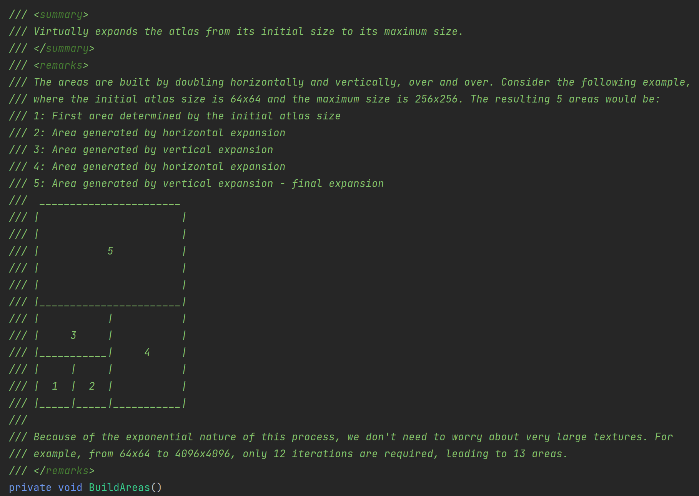

### Allocator2D

是干什么的？是不是用来确定图集分配方式的

### UIRAtlasAllocator

是干什么的？

它里面有BuildAreas

### 一个过期的类 UIRAtlasManager.cs (DynamicAtlasCore)

不用看，过期了

### UIRenderDeviceAllocator.cs

中定义了一个具体的分配策略

## 与YGUI的区别

它会自动扩展图集尺寸

## 其他的一些想法

既然UI Toolkit的大部分能力都是在C#部分实现的（例如：样式解析、布局生成、绘制命令的生成和发起），仅仅依赖了部分Unity引擎的数据结构和API，例如Vector2D、Rect、渲染方法等。

### Q：那能不能将Vector2D换成同样基于C#的Godot中的Vector，将绘制方法也改成Godot中的类似绘制API哪？

基本不可能，从AssemblyInfo.cs中也能看到，它还间接的引用了巨量的Unity其他模块。并且最关键的布局和绘制都是在C++部分实现的，Godot虽然也有绘制接口，但他们之间匹配不上。更难的是布局的计算，这在Godot中完全没有对应API，需要自己实现一份。

### Q：能不能将UI Toolkit拓展成一个支持World Space的UI方案，并让它应用到VR模式中哪？

因为Unity的Editor也依赖了UI Toolkit，并且这个包目前是内建状态，没有直接修改它的可能性，所以基于它的拓展很受限。

但也并非做不到3D UI，可以利用`RenderTexture`+`uGUI`混排来实现世界空间UI，这并不是很难的事。

（官方支持3D UI的计划被排到了很晚，等到稳定版本可能还要2-3年甚至更久。

总的来说：基于UI Toolkit的项目若想3D化，目前比较理想的方式就是uGUI**混排**。并且它是比较支持一个主页面+多个悬浮空间的情景的（类似vision OS的窗口）

